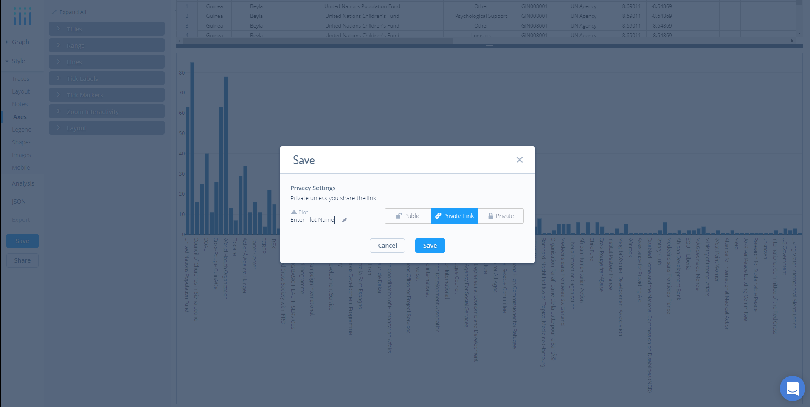

TODO

___

# Aid Agencies during Ebola Outbreak

## Contents

- [Overview](#overview)
- [Data](#1-data)
- [Create a Chart](#2-create-a-chart)
  - [Scattermapbox](#21-scattermapbox)
  - [Pie Chart (Activities)](#22-pie-chart-activities)
  - [Pie Chart (Countries)](#23-pie-chart-countries)
  - [Bar Chart](#24-bar-chart)
- [Create a Dashboard](#3-create-a-dashboard)
  - [Add Charts](#31-add-charts)
  - [Style It](#32-style-it)
- [Crossfilter](#4-crossfilter)

## Overview

In this tutorial, we'll create and style multiple individual plots in the Chart Studio, add them to a dashboard, and utilize the crossfilter function to interact and explore these data further.

## 1. Data

To get started, head to Plotly’s [Chart Studio](https://plot.ly/create/) and add your data. You have the option of typing directly in the grid, uploading your file, or entering a URL of an online dataset. For this tutorial, we'll use the Ebola dataset from the [Humanitarian Data Exchange (HDE)](http://bit.ly/2zq86Mh).
Simply, copy the URL (https://plot.ly/~jackp/18129.csv) or open the [dataset](https://plot.ly/~jackp/18129/) and click **'Fork & Edit'** to begin.

If you choose the latter, the Chart Studio ought to have opened and you're all set to go. If the former, navigate to the [Chart Studio](https://plot.ly/create/) and click **'Import'**, **'By URL'**, and then paste in the **URL** (https://plot.ly/~jackp/18129.csv).

## 2. Create a Chart

Introduction

### 2.1. Scattermapbox

##### 2.1.1. Create

##### 2.1.2. Traces

##### 2.1.3. Layout

##### 2.1.4. Save
Congrats, your chart is complete! Click **Save** on the left-hand side of the screen. In the pop-up, enter your filename and select either **Public** (visible to all) or **Private Link** (visible only to those who you share the link with) and hit **Save**. Since these plots are destined for a dashboard, they can't be set to private.

### 2.2. Pie Chart (Activities)

##### 2.2.1. Create

##### 2.2.2. Traces

##### 2.2.3. Layout

##### 2.2.4. Save
Congrats, your chart is complete! Click **Save** on the left-hand side of the screen. In the pop-up, enter your filename and select either **Public** (visible to all) or **Private Link** (visible only to those who you share the link with) and hit **Save**. Since these plots are destined for a dashboard, they can't be set to private.

### 2.3. Pie Chart (Countries)

##### 2.3.1. Create

##### 2.3.2. Layout

##### 2.3.3. Traces

##### 2.3.4. Save
Congrats, your chart is complete! Click **Save** on the left-hand side of the screen. In the pop-up, enter your filename and select either **Public** (visible to all) or **Private Link** (visible only to those who you share the link with) and hit **Save**. Since these plots are destined for a dashboard, they can't be set to private.

### 2.4. Bar Chart

##### 2.4.1. Create

##### 2.4.2. Layout

##### 2.4.3. Traces

##### 2.4.4. Axes

##### 2.4.5. Save
Congrats, your chart is complete! Click **Save** on the left-hand side of the screen. In the pop-up, enter your filename and select either **Public** (visible to all) or **Private Link** (visible only to those who you share the link with) and hit **Save**. Since these plots are destined for a dashboard, they can't be set to private.

## 3. Create a Dashboard

With the charts completed and saved in your [home folder](https://plot.ly/organize/home), we can now create a dashboard by simply adding these charts, adjusting the layout, and styling the dashboard before sharing and interacting. To get started with creating a dashboard, hover over the *+Create* button and select **Dashboard** from the menu. Alternatively, open this [link](https://plot.ly/dashboard/create).

### 3.1. Add Charts

### 3.2. Style It

Congrats, your dashboard is complete! Click **Save** on in the bottom right-hand side of the screen. In the pop-up, enter your filename and select either **Public** (visible to all), or **Private Link** (visible only to those who you share the link with), or **Private** (visible only to you) and hit **Save**. .

## 4. Crossfilter

TODO
