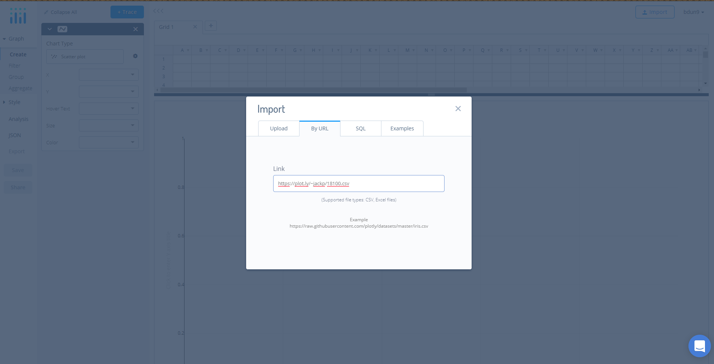
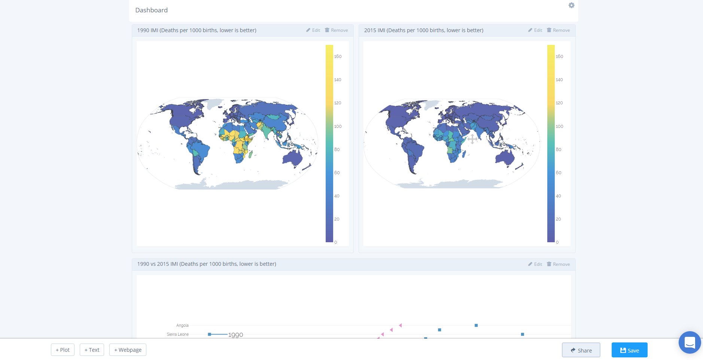
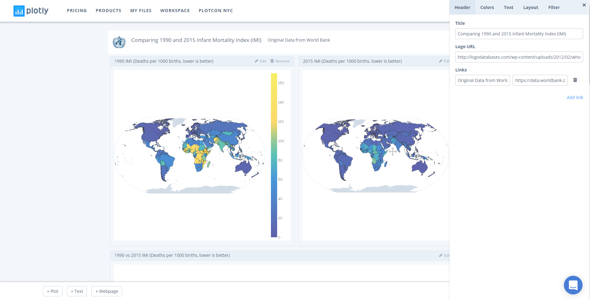
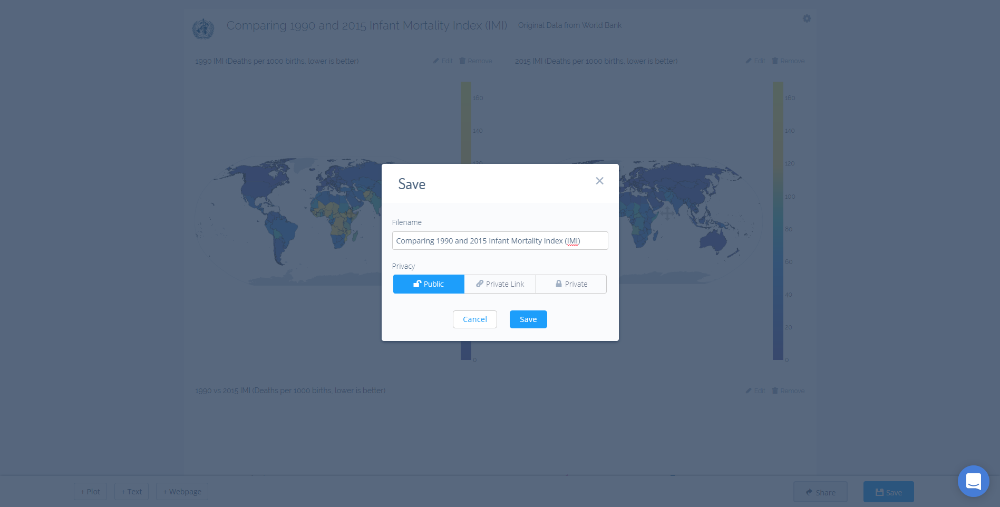

TODO

___

# Comparing 1990 and 2015 Infant Mortality Index

## Contents

- [Overview](#overview)
- [Data](#1-data)
- [Create a Chart](#2-create-a-chart)
  - [Choropleth 1990](#21-choropleth-1990)
  - [Choropleth 2015](#22-choropleth-2015)
  - [Choropleth Map](#23-scatter-plot)
- [Create a Dashboard](#3-create-a-dashboard)
  - [Add Charts](#31-add-charts)
  - [Style It](#32-style-it)
- [Crossfilter](#4-crossfilter)

## Overview

In this tutorial, we'll create and style multiple individual plots in the Chart Studio, add them to a dashboard, and utilize the crossfilter function to interact and explore these data further.

## 1. Data

To get started, head to Plotly’s [Chart Studio](https://plot.ly/create/) and add your data. You have the option of typing directly in the grid, uploading your file, or entering a URL of an online dataset. For this tutorial, we'll use the Mortality rate, infant (per 1,000 live births) dataset from the [World Bank](http://bit.ly/2i2SBjs).
Simply, copy the URL (https://plot.ly/~jackp/18100.csv) or open the [dataset](https://plot.ly/~jackp/18100) and click **'Fork & Edit'** to begin.

If you choose the latter, the Chart Studio ought to have opened and you're all set to go. If the former, navigate to the [Chart Studio](https://plot.ly/create/) and click **'Import'**, **'By URL'**, and then paste in the **URL** (https://plot.ly/~jackp/18100.csv).

## 2. Create a Chart

Introduction

### 2.1. Choropleth 1990

##### 2.1.1. Create

##### 2.1.2. Axes

##### 2.1.3. Traces

##### 2.1.4. Layout

##### 2.1.5. Color Bars

##### 2.1.6. Save
Congrats, your chart is complete! Click **Save** on the left-hand side of the screen. In the pop-up, enter your filename and select either **Public** (visible to all) or **Private Link** (visible only to those who you share the link with) and hit **Save**. Since these plots are destined for a dashboard, they can't be set to private.

### 2.2. Choropleth 2015

##### 2.2.1. Create

##### 2.2.2. Traces

##### 2.2.3. Layout

##### 2.2.4. Axes

##### 2.2.5. Save
Congrats, your chart is complete! Click **Save** on the left-hand side of the screen. In the pop-up, enter your filename and select either **Public** (visible to all) or **Private Link** (visible only to those who you share the link with) and hit **Save**. Since these plots are destined for a dashboard, they can't be set to private.

### 2.3. Scatter Plot

##### 2.3.1. Create

##### 2.3.2. Layout

##### 2.3.3. Traces

##### 2.3.4. Axes

##### 2.3.5. Save
Congrats, your chart is complete! Click **Save** on the left-hand side of the screen. In the pop-up, enter your filename and select either **Public** (visible to all) or **Private Link** (visible only to those who you share the link with) and hit **Save**. Since these plots are destined for a dashboard, they can't be set to private.

## 3. Create a Dashboard

With the charts completed and saved in your [home folder](https://plot.ly/organize/home), we can now create a dashboard by simply adding these charts, adjusting the layout, and styling the dashboard before sharing and interacting. To get started with creating a dashboard, hover over the *+Create* button and select **Dashboard** from the menu. Alternatively, open this [link](https://plot.ly/dashboard/create).

### 3.1. Add Charts

First, to add the 1990 choropleth map, click *+Plot* in the bottom left corner of the screen. A new box ought to appear with the option to 'Add a Plot'. Click, the *'Your Files'* option and then in the pop-up select the **1990 choropleth map** we made earlier.

Next, add the 2015 choropleth map following the same process. This time drag and drop the plot on the right half of the 1990 choropleth map. You ough to something similar to below.

For the final plot, the 1990vs 2015 IMI (Deaths per 1000 births, lower is better) scatter plot, add this to the bottom of the dashboard and drag down accordingly.

Now that we have added all the plots to the dashboard, for each plot where it says "Enter a title..." insert plot titles: **1990 IMI (Deaths per 1000 births, lower is better)**, **2015 IMI (Deaths per 1000 births, lower is better)**, and **1990 vs 2015 IMI (Deaths per 1000 births, lower is better)** in the same order as we added the plots. Your result ought to look like below.

### 3.2. Style It

Now that we have the structure of our dashboard, we can style it. To do so, navigate to the *settings icon* directly opposite the dashboard title. When hovering you ought to see the option settings from the menu.

After clicking *settings*, a panel ought to appear from the right-hand side of the screen. Here, we have the option of headers, colors, text, layout, and filter. First, in *Headers*, we can set the title, add a logo, and multiple links. For this tutorial, add **Comparing 1990 and 2015 Infant Mortality Index (IMI)** to the *Title* text box. Next, let's add the World Bank logo. We can do this by simply adding the URL for the logo JPG: **http://logodatabases.com/wp-content/uploads/2012/02/who-logo-wallpaper-1024x997.jpg**. As previously mentioned you can add links, in this tutorial we'll use this feature to link the original dataset. Thus, add the text **Original Data from World Bank** with the URL: **https://data.worldbank.org/indicator/SP.DYN.IMRT.IN**.

In the next tab, *Colors*, we can manipulate the background, borders, and text colors. As you can see, the dashboard has already added these by default. That said, for this dashboard we will set *Header Background*, *Page Background*, *Box Background*, *Box Border*, and *Box Header Background* to **#FFFFFF**.

*Text*, the third settings option, allows you to control all things text, including font color, family, and size, as well as header styles and text box styles. Again, like the Colors tab, some values are defined. However, here, we'll set the *Font Family* to **Raleway**. Make the header font larger by selecting **1.6em** in the *Header Font Size* and, additionally, change the *Header Font Weight* to **300**.

In *Layout*, you have the option of setting the page layout as either a dashboard or a report. Here, we'll leave it as the default dashboard setting. The last settings category, *Filter*, provides you with the option to enable or disable the Search Bar or the Crossfilter feature. For this tutorial, leave the *Search Bar* as-is but lets enable the *Crossfilter* feature by selecting **enable** (for more information about this feature see the next section).

Congrats, your dashboard is complete! Click **Save** on in the bottom right-hand side of the screen. In the pop-up, enter your filename and select either **Public** (visible to all), or **Private Link** (visible only to those who you share the link with), or **Private** (visible only to you) and hit **Save**. .

## 4. Crossfilter

TODO
