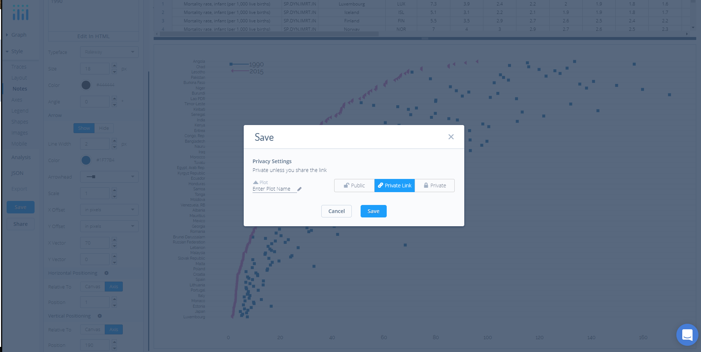

TODO

___

# Comparing 1990 and 2015 Infant Mortality Index

## Contents

- [Overview](#overview)
- [Data](#1-data)
- [Create a Chart](#2-create-a-chart)
  - [Choropleth 1990](#21-choropleth-1990)
  - [Choropleth 2015](#22-choropleth-2015)
  - [Choropleth Map](#23-scatter-plot)
- [Create a Dashboard](#3-create-a-dashboard)
  - [Add Charts](#31-add-charts)
  - [Style It](#32-style-it)
- [Crossfilter](#4-crossfilter)

## Overview

In this tutorial, we'll create and style multiple individual plots in the Chart Studio, add them to a dashboard, and utilize the crossfilter function to interact and explore these data further.

## 1. Data

To get started, head to Plotly’s [Chart Studio](https://plot.ly/create/) and add your data. You have the option of typing directly in the grid, uploading your file, or entering a URL of an online dataset. For this tutorial, we'll use the Mortality rate, infant (per 1,000 live births) dataset from the [World Bank](http://bit.ly/2i2SBjs).
Simply, copy the URL (https://plot.ly/~jackp/18100.csv) or open the [dataset](https://plot.ly/~jackp/18100) and click **'Fork & Edit'** to begin.

If you choose the latter, the Chart Studio ought to have opened and you're all set to go. If the former, navigate to the [Chart Studio](https://plot.ly/create/) and click **'Import'**, **'By URL'**, and then paste in the **URL** (https://plot.ly/~jackp/18100.csv).

## 2. Create a Chart

Introduction

### 2.1. Choropleth 1990

##### 2.1.1. Create

##### 2.1.2. Axes

##### 2.1.3. Traces

##### 2.1.4. Layout

##### 2.1.5. Color Bars

##### 2.1.6. Save
Congrats, your chart is complete! Click **Save** on the left-hand side of the screen. In the pop-up, enter your filename and select either **Public** (visible to all) or **Private Link** (visible only to those who you share the link with) and hit **Save**. Since these plots are destined for a dashboard, they can't be set to private.

### 2.2. Choropleth 2015

##### 2.2.1. Create

##### 2.2.2. Traces

##### 2.2.3. Layout

##### 2.2.4. Axes

##### 2.2.5. Save
Congrats, your chart is complete! Click **Save** on the left-hand side of the screen. In the pop-up, enter your filename and select either **Public** (visible to all) or **Private Link** (visible only to those who you share the link with) and hit **Save**. Since these plots are destined for a dashboard, they can't be set to private.

### 2.3. Scatter Plot

##### 2.3.1. Create

##### 2.3.2. Layout

##### 2.3.3. Traces

##### 2.3.4. Axes

##### 2.3.5. Save
Congrats, your chart is complete! Click **Save** on the left-hand side of the screen. In the pop-up, enter your filename and select either **Public** (visible to all) or **Private Link** (visible only to those who you share the link with) and hit **Save**. Since these plots are destined for a dashboard, they can't be set to private.

## 3. Create a Dashboard

With the charts completed and saved in your [home folder](https://plot.ly/organize/home), we can now create a dashboard by simply adding these charts, adjusting the layout, and styling the dashboard before sharing and interacting. To get started with creating a dashboard, hover over the *+Create* button and select **Dashboard** from the menu. Alternatively, open this [link](https://plot.ly/dashboard/create).

### 3.1. Add Charts

### 3.2. Style It

Congrats, your dashboard is complete! Click **Save** on in the bottom right-hand side of the screen. In the pop-up, enter your filename and select either **Public** (visible to all), or **Private Link** (visible only to those who you share the link with), or **Private** (visible only to you) and hit **Save**. .

## 4. Crossfilter

TODO
