TODO

- images done by need added
- restructure layout
- proofread
___

# Motor Trend Car Road Tests 1970-71

In this tutorial, we'll create and style multiple individual plots in the Chart Studio, add them to a dashboard, and utilize the crossfilter function to interact and explore these data further.

## Contents

- [Data](#1-data)
- [Create a Chart](#2-create-a-chart)
  - [Car Model Bar Chart](#21-car-model-bar-chart)
  - [Mpg vs Cylinder Scatter Plot](#22-mpg-vs-cylinder-scatter-plot)
  - [Hp vs Acc Scatter Plot](#23-mpg-vs-cylinder-scatter-plot)
  - [Hp vs Disp Scatter Plot](#24-mpg-vs-cylinder-scatter-plot)
  - [Weight vs Hp Scatter Plot](#25-mpg-vs-cylinder-scatter-plot)
  - [Weight vs Acc Scatter Plot](#26-mpg-vs-cylinder-scatter-plot)
- [Create a Dashboard](#3-create-a-dashboard)
  - [Add Charts](#31-add-charts)
  - [Style It](#32-style-it)
- [Crossfilter](#4-crossfilter)

## 1. Data

To get started, head to Plotly’s [Chart Studio](https://plot.ly/create/) and add your data. You have the option of typing directly in the grid, uploading your file, or entering a URL of an online dataset. For this tutorial, we'll use the Motor Trend Car Road Tests dataset from the [1974 Motor Trend US magazine](https://gist.github.com/omarish/5687264).

In this dashboard, each of the six plots have been made with a unique dataset. That is, one plot to one dataset. Therefore, we have taken the above dataset and created 6 unique sub-datasets. Below, is table of the plot / sub-dataset associations:

| Plot | Dataset |
| -------------- | ------------- |
| Car Model Bar Chart | https://plot.ly/~bdun9/2395/  |
| Mpg vs Cylinder Scatter Plot | https://plot.ly/~bdun9/2385/ |
| Hp vs Acc Scatter Plot | https://plot.ly/~bdun9/2381/ |
| Hp vs Disp Scatter Plot | https://plot.ly/~bdun9/2405/  |
| Weight vs Hp Scatter Plot | https://plot.ly/~bdun9/2384/  |
| Weight vs Acc Scatter Plot | https://plot.ly/~bdun9/2382/  |

## 2. Create a Chart

To visualize Motor Trend Car Road Tests 1970-71, we'll create six individual charts: (1) a horizontal bar chart of miles per gallon (mpg) by car model, (2) a scatter plot of mpg vs cyclinders, and a further four scatter plots composed of different variables: horsepower vs acceleration, horsepower vs displacement, weight vs horsepower, and weight vs acceleration. As previously mentioned, the main intention of these charts is that they are each created from a unique dataset.

### 2.1. Car Model Bar Chart

##### 2.1.1. Create
Now that we have the data in the grid, we can select our chart type. To do so, select *Graph* on the left-hand side, then *Create*. Click *Chart Type*, and **Bar Chart** from the *Business* column.

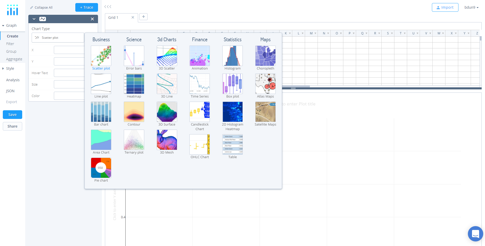

Next, we can populate the graph by selecting **mpg** and **name** in the *x* and *y* dropdowns. You ought to see a bar chart like below

##### 2.1.2. Traces
Now that the graph is populated, we can look to style it. Thus, under the *Style* tab select *Traces*. Since we want to make a horizontal bar chart, we cab simply click **Horizontal** and magic is done for us. In this tutorial were going to style the markers / traces black thus set the *Fill* to **#000000**. To prevent any clutter we alter the *Size and Spacing* by setting the *Bar Width* to **70** and *Padding* to **10**.

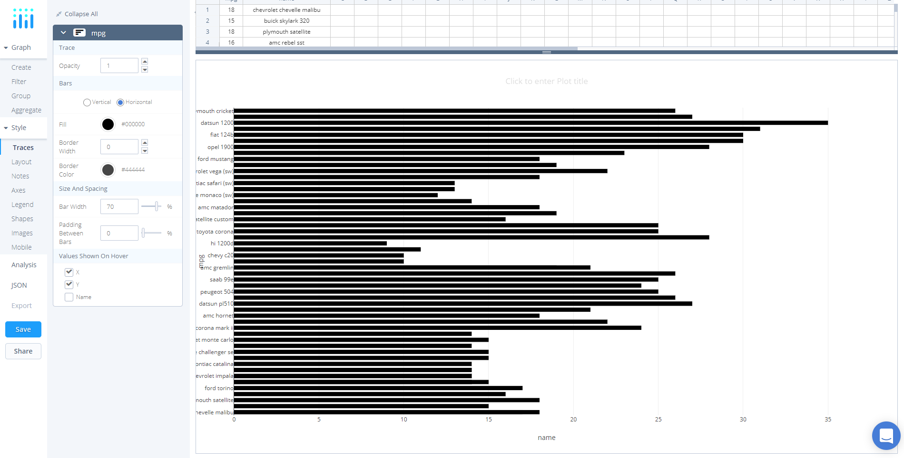

##### 2.1.3. Layout
Moving on to the *Layout*, we will set our background color. Here, set the *Plot* and *Margin Color* to **F0F0F0**.

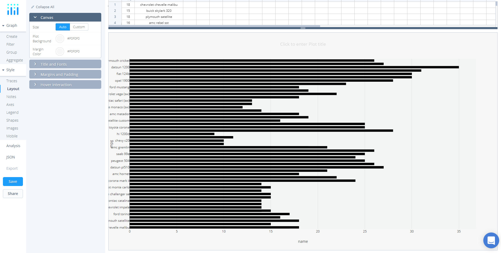

Next, open *Title and Fonts* and in *Global Font* set the *Typeface* to **Raleway** and *Size* to **10**. We'll use a smaller font size due to the volume of text on the y axis.

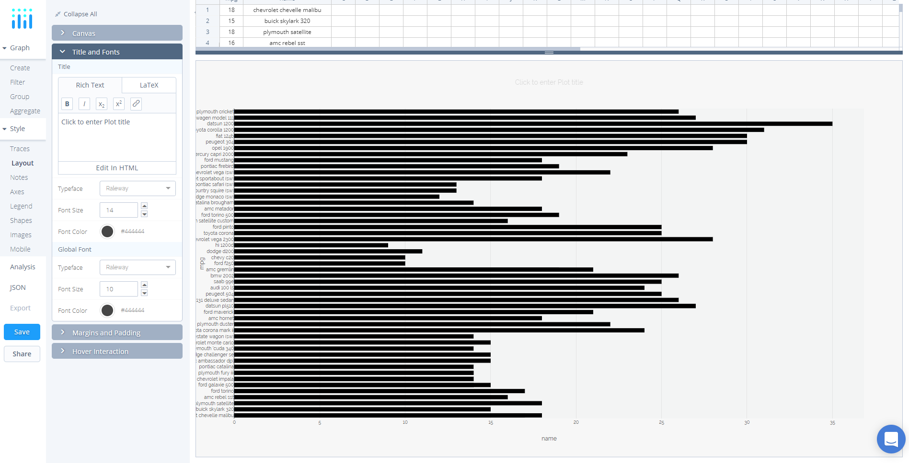

Again, due to the text on the y axis, select the *Margins and Padding* box
and enter the values **0, 20, 150, 10, 0**, respectively. This ought to have provided you with something similar to below.

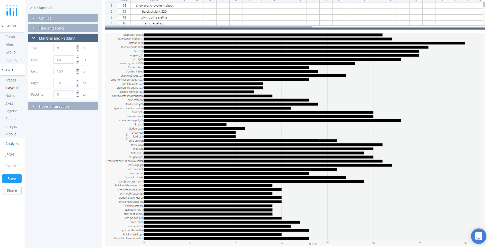

##### 2.1.4. Axes
Now that we've finished with the *Layout*, navigate to *Axes* wher *Titles* ought to be open already. Set *x* to **Mpg** and *Font Size* **12** before removing the *y* title.

Next, open *Lines*, *All*, and select **Hide** for all options.

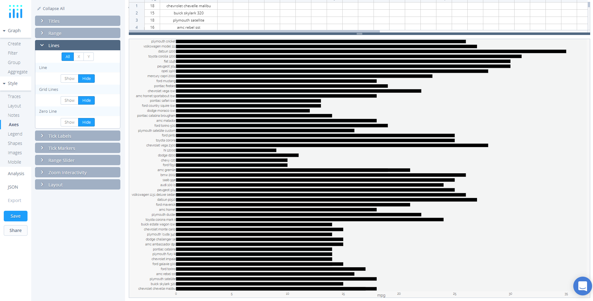

Finally, select *Zoom Interactivity* and click **disable**.

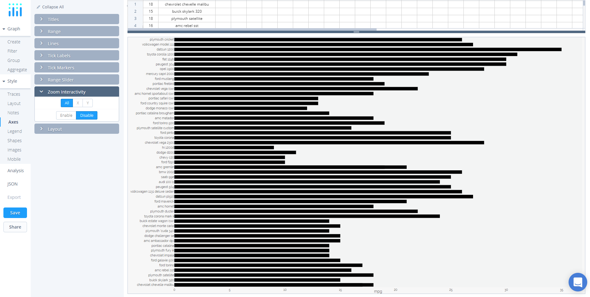

##### 2.1.5. Save
Congrats, your chart is complete! Click **Save** on the left-hand side of the screen. In the pop-up, enter your filename and select either **Public** (visible to all) or **Private Link** (visible only to those who you share the link with) and hit **Save**. Since these plots are destined for a dashboard, they can't be set to private.

### 2.2. Mpg vs Cylinder Scatter Plot

##### 2.2.1. Create
Now that we have the data in the grid, we can select our chart type. To do so, select *Graph* on the left-hand side, then *Create*. Click *Chart Type*, and **Scatter Chart** from the *Business* column.

Next, we can populate the graph by selecting **mpg** and **cylinders** in the *x* and *y* dropdowns. You ought to see a bar chart like below.

##### 2.2.2. Traces
Now that the graph is populated, we can look to style it. Thus, under the *Style* tab select *Traces*. Continuing with our theme, style the markers / traces black by setting the *Color* to **#000000**. Additionally, minimize the *Diameter* to **4**.

##### 2.2.3. Layout
To change the background color, click *Layout* under *Style* and set the *Color* to **F0F0F0**.

Next, open *Title and Fonts* and in *Global Font* set the *Typeface* to **Raleway** and *Size* to **13**.

To set the margins, select the *Margins and Padding* box
and enter the values **20, 50, 50, 20, 0**, respectively.

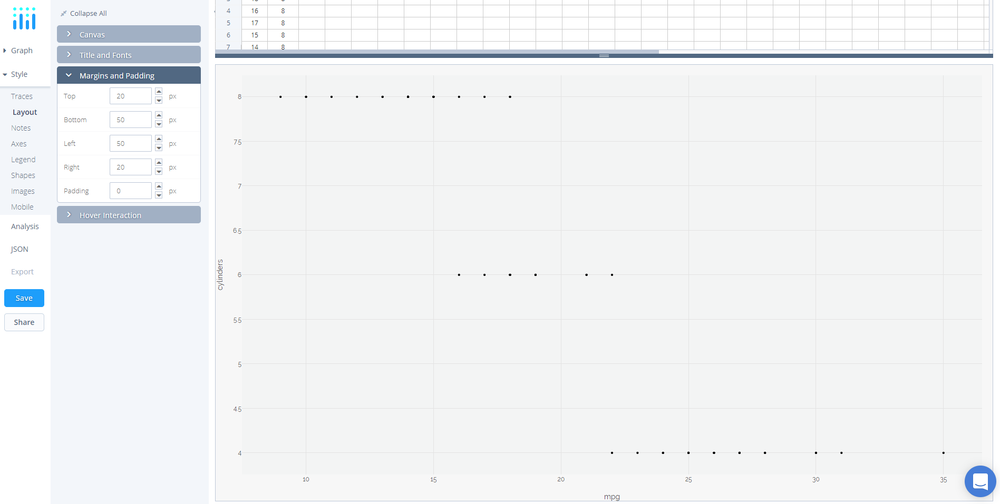

##### 2.2.4. Axes
Now that we've finished with the *Layout*, navigate to *Axes* wher *Titles* ought to be open already. Set *x* to **Mpg** and *Font Size* **12**, *y* to **Cylinders** and *Font Size* **12**.

Next, open *Lines*, *x*, and select **Hide** for all options. Leave the *y* grid lines as **Show**.

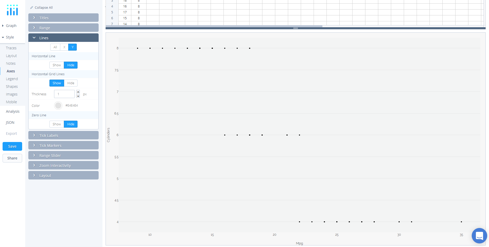

text

Finally, select *Zoom Interactivity* and click **disable**.

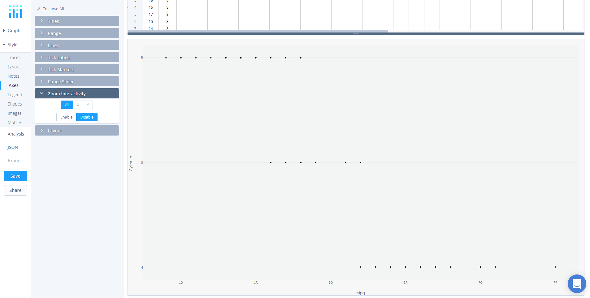

##### 2.2.5. Save
Congrats, your chart is complete! Click **Save** on the left-hand side of the screen. In the pop-up, enter your filename and select either **Public** (visible to all) or **Private Link** (visible only to those who you share the link with) and hit **Save**. Since these plots are destined for a dashboard, they can't be set to private.

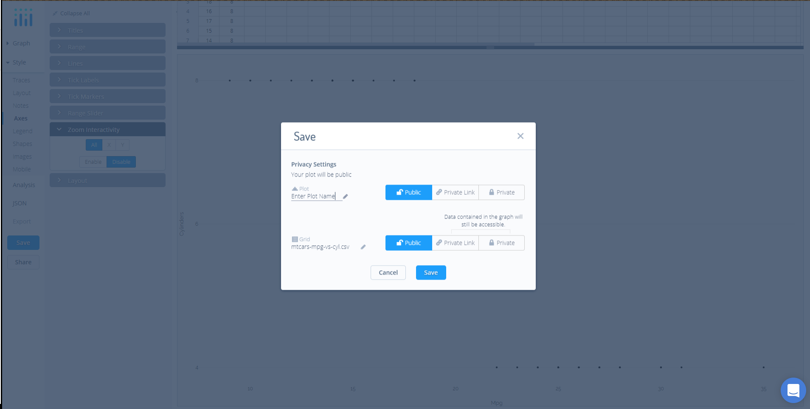

### 2.3. Hp vs Acc Scatter Plot

##### 2.3.1. Create
Now that we have the data in the grid, we can select our chart type. To do so, select *Graph* on the left-hand side, then *Create*. Click *Chart Type*, and **Scatter Chart** from the *Business* column.

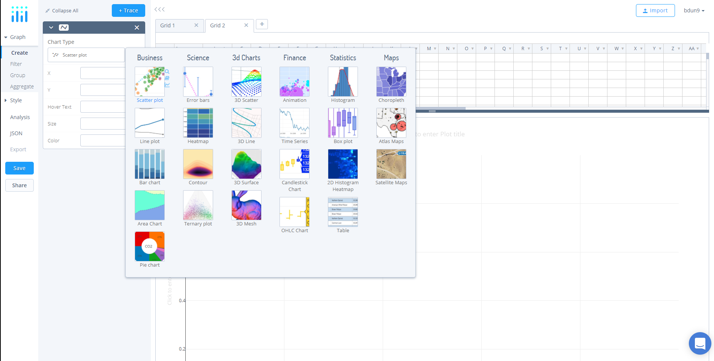

Next, we can populate the graph by selecting **mpg** and **cylinders** in the *x* and *y* dropdowns. You ought to see a bar chart like below.

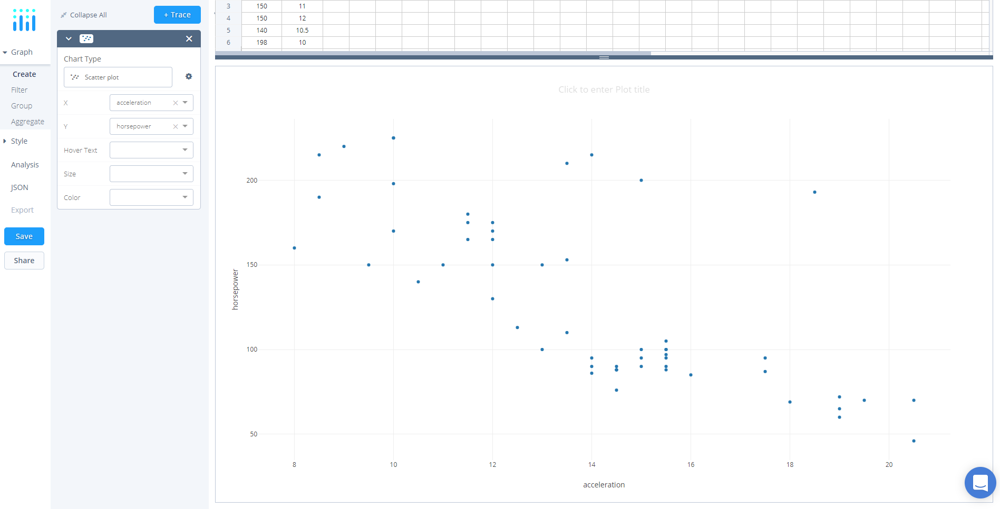

##### 2.3.2. Traces
Now that the graph is populated, we can look to style it. Thus, under the *Style* tab select *Traces*. Continuing with our theme, style the markers / traces black by setting the *Color* to **#000000**. Additionally, minimize the *Diameter* to **4**.

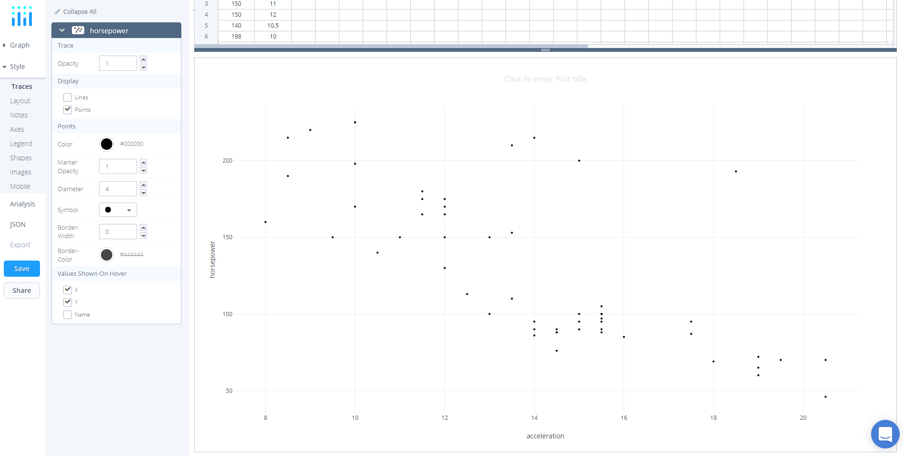

##### 2.3.3. Layout
To change the background color, click *Layout* under *Style* and set the *Color* to **F0F0F0**.

Next, open *Title and Fonts* and in *Global Font* set the *Typeface* to **Raleway** and *Size* to **13**.

To set the margins, select the *Margins and Padding* box
and enter the values **20, 50, 50, 20, 0**, respectively.

##### 2.3.4. Axes
Now that we've finished with the *Layout*, navigate to *Axes* wher *Titles* ought to be open already. Set *x* to **Acceleration** and *Font Size* **12**, *y* to **Horsepower** and *Font Size* **12**.

Next, open *Lines*, *All*, and select **Hide** for all options.

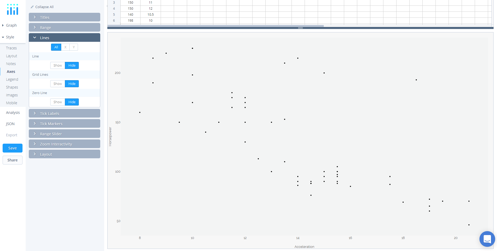

Finally, select *Zoom Interactivity* and click **disable**.

##### 2.3.5. Save
Congrats, your chart is complete! Click **Save** on the left-hand side of the screen. In the pop-up, enter your filename and select either **Public** (visible to all) or **Private Link** (visible only to those who you share the link with) and hit **Save**. Since these plots are destined for a dashboard, they can't be set to private.

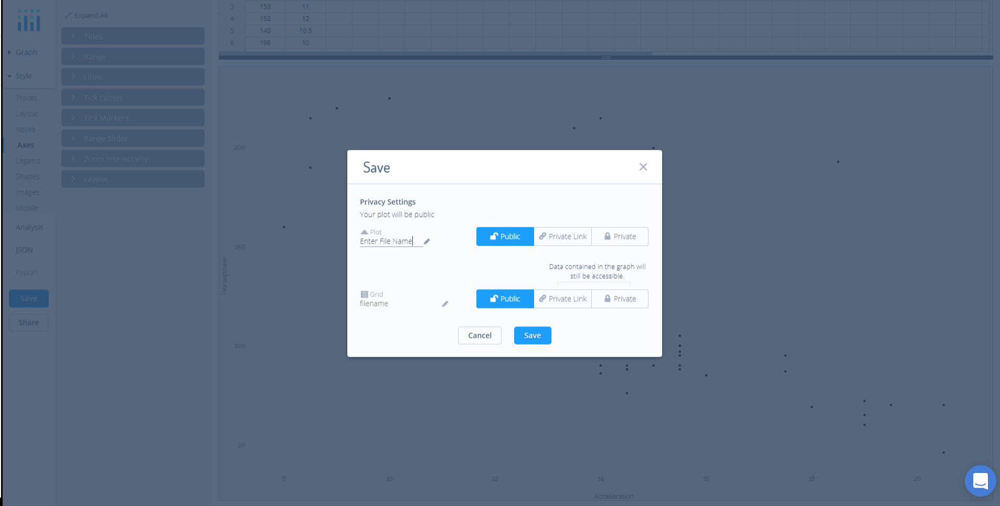

### 2.4. Hp vs Disp Scatter Plot

##### 2.4.1. Create
Now that we have the data in the grid, we can select our chart type. To do so, select *Graph* on the left-hand side, then *Create*. Click *Chart Type*, and **Scatter Chart** from the *Business* column.

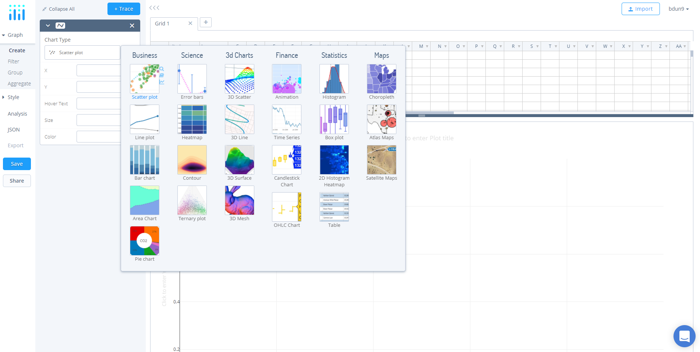

Next, we can populate the graph by selecting **mpg** and **cylinders** in the *x* and *y* dropdowns. You ought to see a bar chart like below.

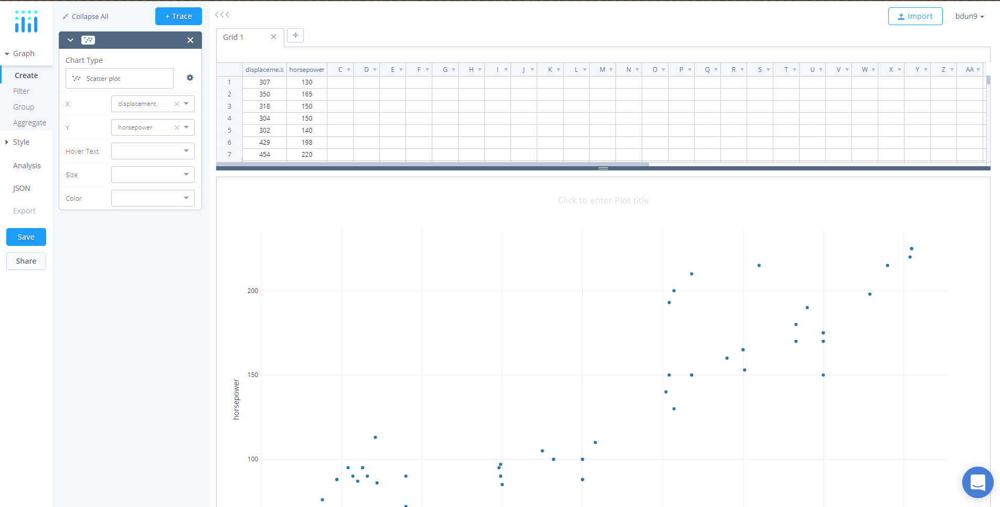

Refer to 2.3.2 onwards (enter the appropriate titles when following 2.3.4).

### 2.5. Weight vs Hp Scatter Plot

##### 2.5.1. Create
Now that we have the data in the grid, we can select our chart type. To do so, select *Graph* on the left-hand side, then *Create*. Click *Chart Type*, and **Scatter Chart** from the *Business* column.

Next, we can populate the graph by selecting **hp** and **weight** in the *x* and *y* dropdowns. You ought to see a bar chart like below.

Refer to 2.3.2 onwards (enter the appropriate titles when following 2.3.4).

### 2.6. Weight vs Acc Scatter Plot

##### 2.6.1. Create
Now that we have the data in the grid, we can select our chart type. To do so, select *Graph* on the left-hand side, then *Create*. Click *Chart Type*, and **Scatter Chart** from the *Business* column.

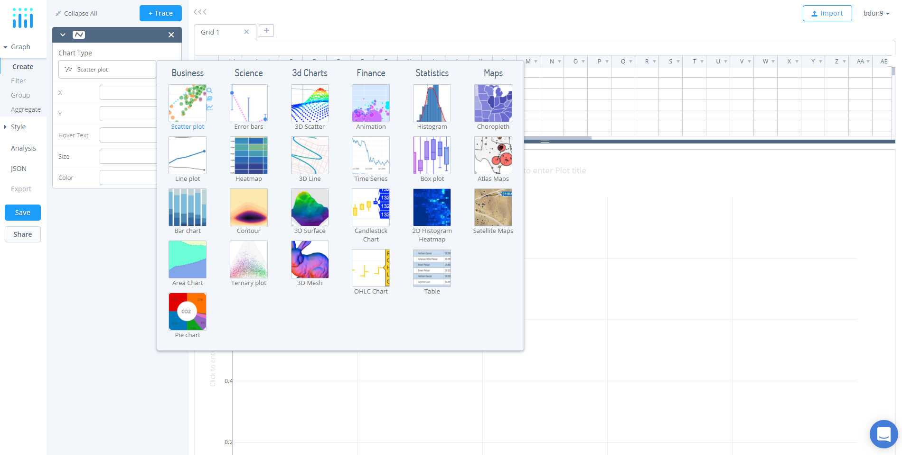

Next, we can populate the graph by selecting **acc** and **weight** in the *x* and *y* dropdowns. You ought to see a bar chart like below.

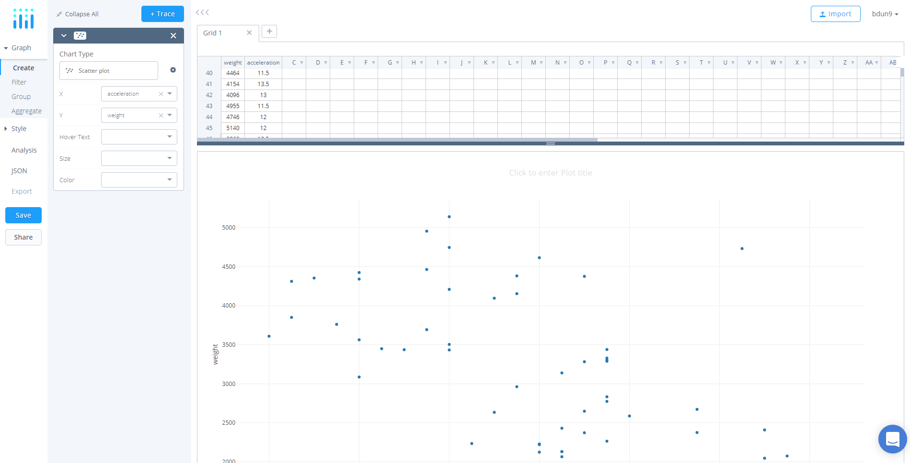

Refer to 2.3.2 onwards (enter the appropriate titles when following 2.3.4).

## 3. Create a Dashboard

With the charts completed and saved in your [home folder](https://plot.ly/organize/home), we can now create a dashboard by simply adding these charts, adjusting the layout, and styling the dashboard before sharing and interacting. To get started with creating a dashboard, hover over the *+Create* button and select **Dashboard** from the menu. Alternatively, open this [link](https://plot.ly/dashboard/create).

### 3.1. Add Charts
First, to add the pie chart, click *+Plot* in the bottom left corner of the screen. A new box ought to appear with the option to 'Add a Plot'. Click, the *'Your Files'* option and then in the pop-up select the **Car Model Bar Chart** we made earlier.

Next, add the scatter plot immediately below following the same process.

Like previously, add the choropleth map following the same process. This time drag and drop the plot on the right half of the scatter plot.

Now that we have added all the plots to the dashboard, for each plot where it says "Enter a title..." insert plot titles: **Miles Per Gallon by Car Model**, **Mpg vs Cylinder**, **Displacement vs Horsepower**, **Acceleration vs Horsepower**, **Horsepower vs Weight**, and **Acceleration vs Weight**, respectively. Your result ought to look like below.

### 3.2. Style It

Now that we have the structure of our dashboard, we can style it. To do so, navigate to the *settings icon* directly opposite the dashboard title. When hovering you ought to see the option settings from the menu.

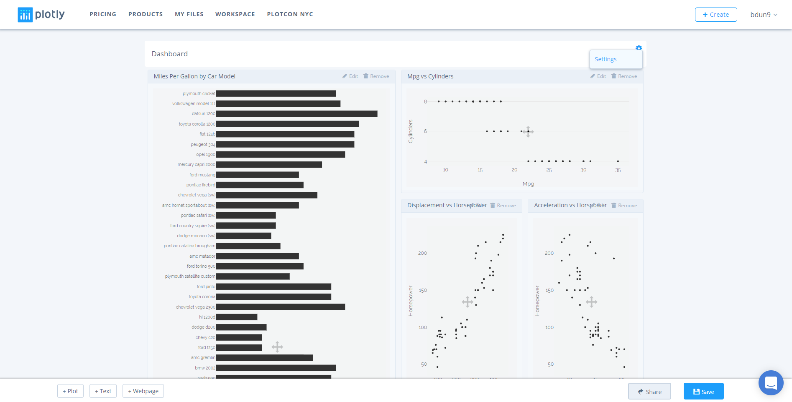

After clicking *settings*, a panel ought to appear from the right-hand side of the screen. Here, we have the option of headers, colors, text, layout, and filter. First, in *Headers*, we can set the title, add a logo, and multiple links. For this tutorial, add **Motor Trend Car Road Tests 1970-71** to the *Title* text box. Now, lets add a link to the original dataset. by add the text **Data Source: mtcars** with the URL: **https://gist.github.com/omarish/5687264**.

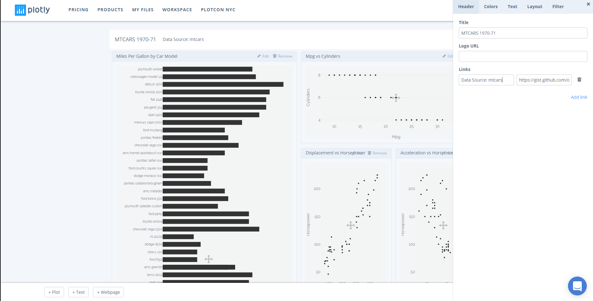

In the next tab, *Colors*, we can manipulate the background, borders, and text colors. As you can see, the dashboard has already added these by default. That said, for this dashboard we will set *Header Background* to **#000000**, *Header Font Color* to **#FFFFFF**, *Page Background*, *Box Background*, and *Box Header Background* to **#F0F0F0**. Lastly, enter **#000000** as the *Box Border* and *Box Header Font Color*.

*Text*, allows you to control all things text, including font color, family, and size, as well as header styles and text box styles. Again, like the *Colors* tab, some values are defined. However, here, we'll set the *Font Color* to **#000000** and *Font Family* to **Raleway**. Set the header font to **1.6em** in the *Header Font Size* and, additionally, change the *Header Font Weight* to **300**. We can leave the remainder as-is.

In *Layout*, you have the option of setting the page layout as either a dashboard or a report. Here, we'll leave it as the default dashboard setting. The last settings category, *Filter*, provides you with the option to enable or disable the Search Bar or the Crossfilter feature. For this tutorial, **enable** both *Search Bar* and the *Crossfilter* feature (for more information about this feature see the next section). Now, like below, you ought to see a search bar and filter dropdown appear below the dashboard header.

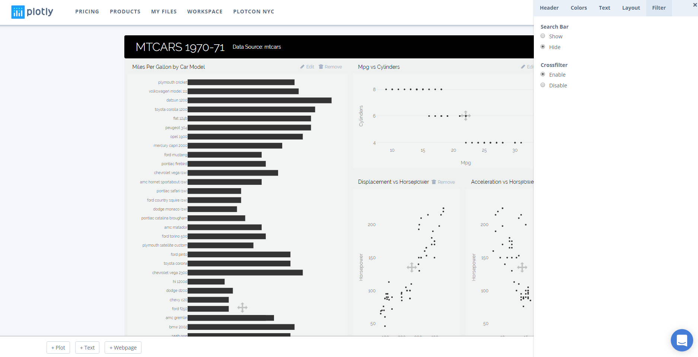

Congrats, your dashboard is complete! Click **Save** on in the bottom right-hand side of the screen. In the pop-up, enter your filename and select either **Public** (visible to all), or **Private Link** (visible only to those who you share the link with), or **Private** (visible only to you) and hit **Save**. .

## 4. Crossfilter

Crossfilter is a visual analysis technique for multidimensional data. It is used to clarify relationships between dimensions. As discussed in the previous section, crossfilter functionality is invoked by setting **enable** in Settings > Filter.

To use crossfilter, simply click-and-drag on a chart. Selected data that shares common rows with other charts will highlight and all other data will fade out. To reset the dashboard, click anywhere on a graph that doesn't have data.

