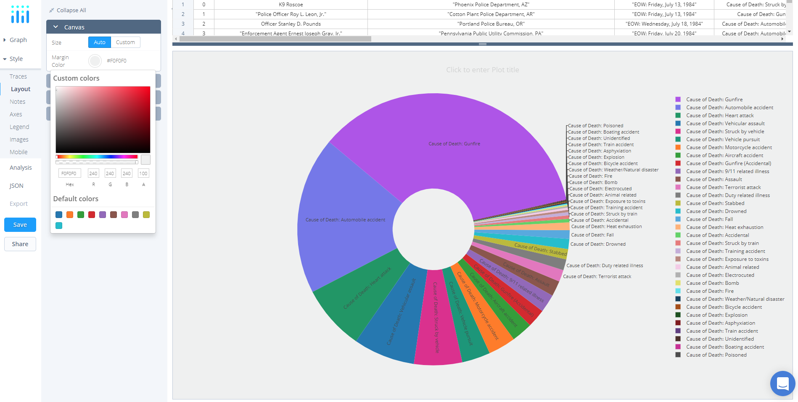
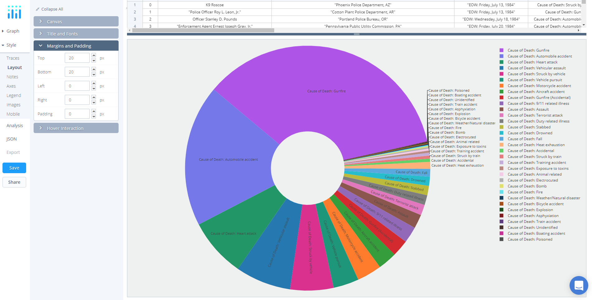
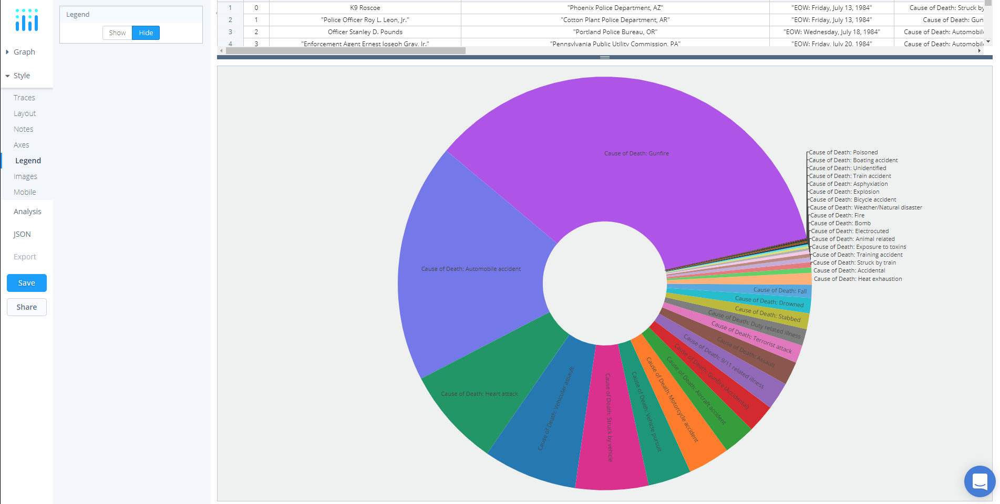
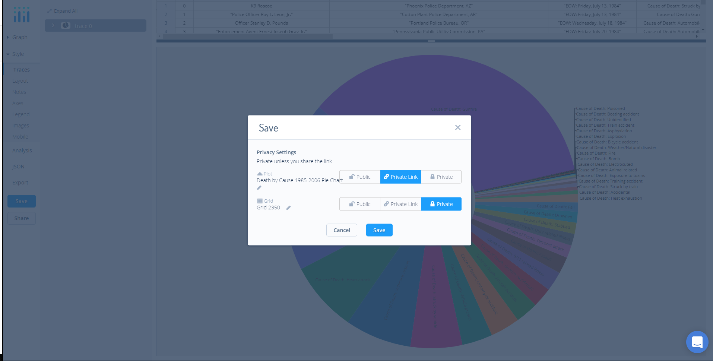
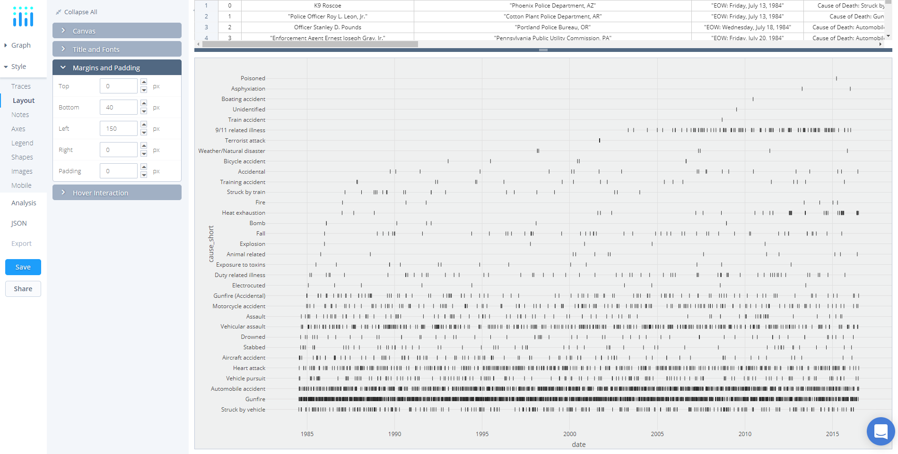
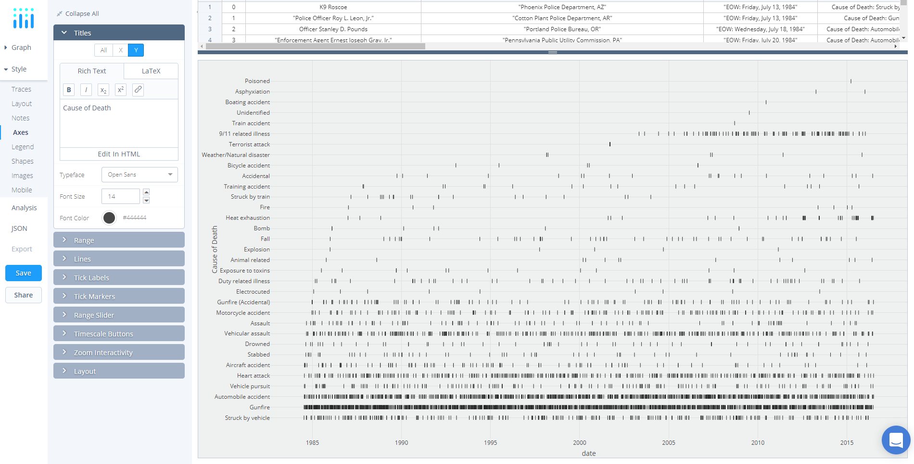
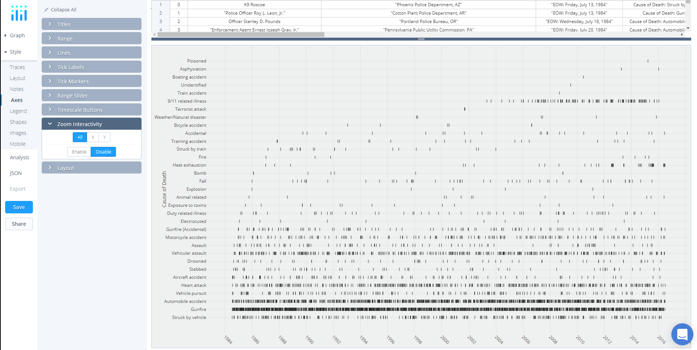
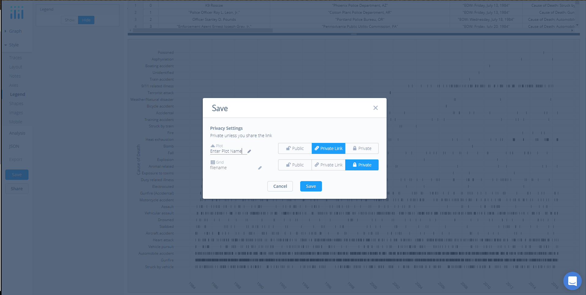
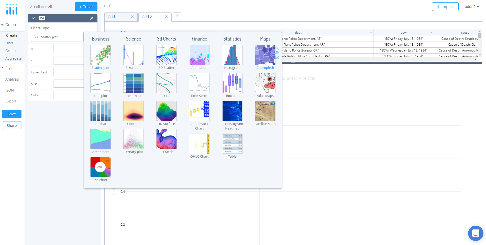
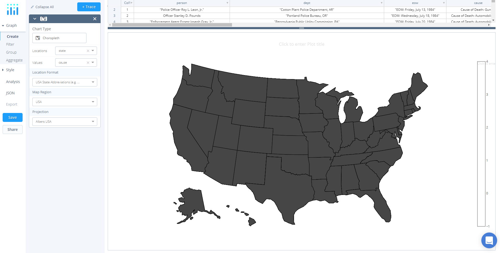

TODO

- dashboard images
- dashboard section
- restructure layout
- proofread
___

# U.S. Police officer deaths by cause

## Contents

- [Overview](#overview)
- [Data](#1-data)
- [Create a Chart](#2-create-a-chart)
  - [Pie Chart](#21-pie-chart)
  - [Scatter Plot](#22-scatter-plot)
  - [Choropleth Map](#23-choropleth-map)
- [Create a Dashboard](#3-create-a-dashboard)
  - [Add Charts](#31-add-charts)
  - [Style It](#32-style-it)
- [Crossfilter](#4-crossfilter)

## Overview

In this tutorial, we'll create and style multiple individual plots in the Chart Studio, add them to a dashboard, and utilize the crossfilter function to interact and explore these data further.

## 1. Data

To get started, head to Plotly’s [Chart Studio](https://plot.ly/create/) and add your data. You have the option of typing directly in the grid, uploading your file, or entering a URL of an online dataset. For this tutorial, we'll use the Police Killings dataset from the [FiveThirtyEight](http://bit.ly/237YWtv).
Simply, copy the URL (https://plot.ly/~public.health/17.csv) or open the [dataset](https://plot.ly/~public.health/17/) and click **'Fork & Edit'** to begin.

If you choose the latter, the Chart Studio ought to have opened and you're all set to go. If the former, navigate to the [Chart Studio](https://plot.ly/create/) and click **'Import'**, **'By URL'**, and then paste in the **URL** (https://plot.ly/~public.health/17.csv).

## 2. Create a Chart

Introduction

### 2.1. Pie Chart

##### 2.1.1. Create
Now that we have the data in the grid, we can select our chart type. To do so, select *Graph* on the left-hand side, then *Create*. Click *Chart Type*, and **Pie Chart** from the *Business* column.

Next, we can populate the graph by selecting **cause** in the *Labels* dropdown. You ought to see a pie chart with a legend like below.

##### 2.1.2. Traces
To style the pie chart, we can make changes to the text, colors, borders, and order. To do so, navigate to the *Traces* tab under *Style*. Here, **select Label** and **unselect %**, change the *Font Size* to **11**, set the *Rotation* to **130 degrees**, and *Hole* to **30%**.

##### 2.1.4. Layout
To change the background color, click *Layout* under *Style* and set the *Color* to **F0F0F0**.

To set the margins, select the *Margins and Padding* box
and enter the values **20, 20, 0, 0, 0**, respectively.

##### 2.1.4. Legend
With the styling done and the option to use labels directly on the slices means that the legend on the right-hand side is redundant. Thus, click *Legend* under *Style* and select **Hide**.

##### 2.1.5. Save
Congrats, your chart is complete! Click **Save** on the left-hand side of the screen. In the pop-up, enter your filename and select either **Public** (visible to all) or **Private Link** (visible only to those who you share the link with) and hit **Save**. Since these plots are destined for a dashboard, they can't be set to private.

### 2.2. Scatter Plot

##### 2.2.1. Create
Now that we have the data added to the grid, we can select our chart type. To do so, select *Graph* on the left-hand side, then *Create*. Click *Chart Type*, and **Scatter** from the *Business* column.

Now to populate the graph with data, in the *x* and *y* dropdown select **date** and **cause_short**, respectively.

##### 2.2.2. Traces
With the data plotted, let's style the plot by first changing the scatter ponits color and symbol. Click *Traces*, set the points *Color* to **#222222** and change the *Symbol* to **|** (situated at the bottom of the symbol box).

##### 2.2.3. Layout
Next, navigate to the *Layout* tab to set the background colors, and margins. To complete the former, open the *Canvas* box and set the color, for both plot and margin, to **#F0F0F0**.

To set the margins, select the *Margins and Padding* box
and enter the values **0, 40, 150, 0, 0**, respectively.

##### 2.2.4. Axes
Moving on the the *Axes* tab, select *Title*. Remove the title under the x axis, then click *y* and in the text editor type **"Causes of Death"**. Leave the *Typeface* as **Open Sans** and *Font Size* as **14**.

Next, navigate to *Tick Labels*. In the *x* axis, set the *Angle* to **45 degrees** and the *Number of Labels* to **Custom** and **20**.

Finally, select *Zoom Interactivity* and click **disable**.

##### 2.2.5. Save
Congrats, your chart is complete! Click **Save** on the left-hand side of the screen. In the pop-up, enter your filename and select either **Public** (visible to all) or **Private Link** (visible only to those who you share the link with) and hit **Save**. Since these plots are destined for a dashboard, they can't be set to private.

### 2.3. Choropleth Map

##### 2.3.1. Create
Like the previous charts, once you've added the data, select *Graph* on the left-hand side, then *Create*. Click *Chart Type*, and **Choropleth** from the *Maps* column.

Now to populate the graph with data, in the *Locations* and *Values* dropdown select **state** and **cause**, respectively. Additionally, set **USA State Abbreviations** in the *Locations Format* dropdown, **USA** in the *Map Regions*, and set the *Porjections* to **Albers USA**. You ought to note that states aren't defined yet as we need to aggregate the data.

##### 2.3.2. Aggregate
Thus, under *Graph* click *Aggregate*. Next, click the blue *+ Agreggate* button. In the box that appears, select **state** as the *Group By Column*. Set *Trace* to **cause**, *z* to **count**, and leave *Locations* as **first**. You ought to not see something similar to below.

##### 2.3.3. Traces
The blue is hard to decipher, so navigate to the *Traces* tab and set the *Colorscale* to **yellow to purple** (roughly the 8th from the left).

##### 2.3.4. Layout
Now that the choropleth is populated and colored, navigate to the *Layout* tab to style the background, margins, and the geo style and layout. First, open the *Canvas* box and set the *Color* to **#F0F0F0**.

To make the map the full width and height, open *Margins and Paddings* and set all the values to **0**.

Unique to choropleth maps, we have *Geo Layout*. Here, you define attributes such as *Map Scope*, *Projection*, *Rotation*, *Scale*, and *Map Resolution*. Set the latter to **1:50,000,000**.

##### 2.3.5. Color Bars
Finally, you can style the color bar by navigating to *Color Bars*. To minimize the size of the color bar, select the *Size and Positioning* box and set the *Width* to **20**.

##### 2.3.6. Save
Congrats, your chart is complete! Click **Save** on the left-hand side of the screen. In the pop-up, enter your filename and select either **Public** (visible to all) or **Private Link** (visible only to those who you share the link with) and hit **Save**. Since these plots are destined for a dashboard, they can't be set to private.

## 3. Create a Dashboard

With the charts completed and saved in your [home folder](https://plot.ly/organize/home), we can now create a dashboard by simply adding these charts, adjusting the layout, and styling the dashboard before sharing and interacting. To get started with creating a dashboard, hover over the *+Create* button and select **Dashboard** from the menu. Alternatively, open this [link](https://plot.ly/dashboard/create).

### 3.1. Add Charts

### 3.2. Style It

Congrats, your dashboard is complete! Click **Save** on in the bottom right-hand side of the screen. In the pop-up, enter your filename and select either **Public** (visible to all), or **Private Link** (visible only to those who you share the link with), or **Private** (visible only to you) and hit **Save**. .

## 4. Crossfilter

TODO
